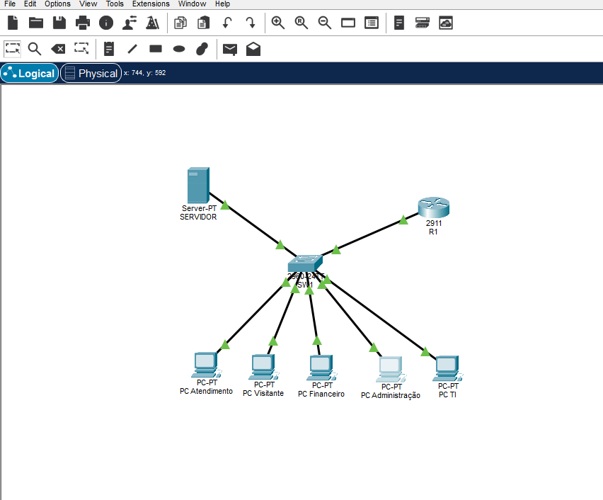
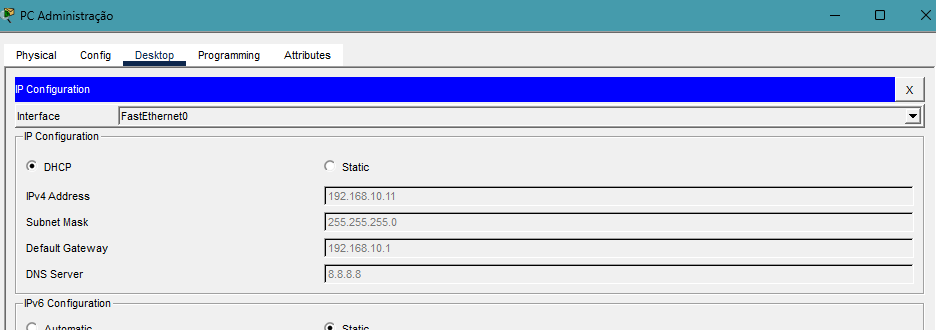
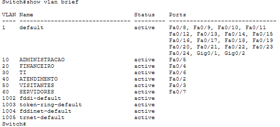
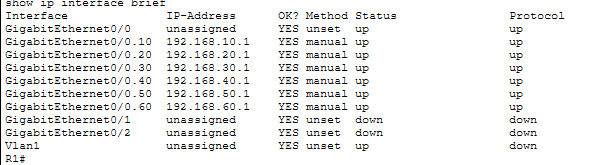
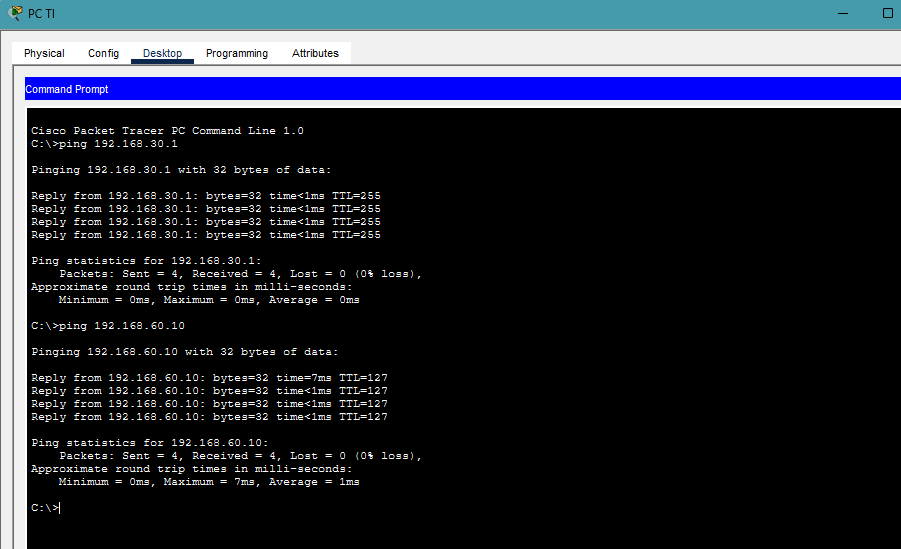

# Rede Corporativa - Packet Tracer

Projeto feito no Cisco Packet Tracer para simular uma rede corporativa simples, separada por setores usando VLANs.

A ideia foi montar um ambiente parecido com o de uma pequena empresa, com PCs de setores diferentes, um servidor interno, DHCP para os computadores e testes de comunicacao entre as redes.

## Cenario

A rede foi dividida nos seguintes setores:

- Administracao
- Financeiro
- TI / Suporte
- Atendimento
- Visitantes
- Servidores

Cada setor ficou em uma VLAN propria e com uma faixa de IP diferente. Isso ajuda a organizar melhor a rede e facilita a manutencao.

## Tecnologias e conceitos usados

- Cisco Packet Tracer
- IPv4
- VLANs
- DHCP
- Roteamento entre VLANs
- Switch 2960
- Roteador 2911
- Servidor com IP fixo
- Testes com `ping`
- Documentacao tecnica

## Topologia



O projeto usa:

- 1 roteador Cisco 2911
- 1 switch Cisco 2960
- 5 PCs, um para cada setor
- 1 servidor interno

O arquivo do Packet Tracer esta na raiz do repositorio:

```text
rede-corporativa-packet-tracer.pkt
```

## Plano de enderecamento

| Setor | VLAN | Rede | Gateway |
| --- | --- | --- | --- |
| Administracao | 10 | 192.168.10.0/24 | 192.168.10.1 |
| Financeiro | 20 | 192.168.20.0/24 | 192.168.20.1 |
| TI / Suporte | 30 | 192.168.30.0/24 | 192.168.30.1 |
| Atendimento | 40 | 192.168.40.0/24 | 192.168.40.1 |
| Visitantes | 50 | 192.168.50.0/24 | 192.168.50.1 |
| Servidores | 60 | 192.168.60.0/24 | 192.168.60.1 |

O servidor ficou com IP fixo:

```text
192.168.60.10
```

## DHCP

Os computadores foram configurados para receber IP automaticamente por DHCP.

Exemplo de PC da Administracao recebendo IP:



## Configuracao das VLANs

No switch, cada porta foi colocada na VLAN do setor correspondente.



## Configuracao do roteador

O roteador foi configurado com subinterfaces para permitir a comunicacao entre as VLANs.



## Testes

Foram feitos testes de conectividade usando `ping`.

Exemplo de teste feito a partir do PC da TI:



Alguns testes realizados:

| Origem | Destino | Resultado |
| --- | --- | --- |
| PC Administracao | Gateway 192.168.10.1 | Sucesso |
| PC Financeiro | Gateway 192.168.20.1 | Sucesso |
| PC TI | Gateway 192.168.30.1 | Sucesso |
| PC TI | Servidor 192.168.60.10 | Sucesso |
| PCs dos setores | Servidor interno | Sucesso |

## Estrutura do repositorio

```text
rede-corporativa-packet-tracer/
|-- assets/
|   |-- topologia-geral.png
|   |-- dhcp-pc-administracao.png
|   |-- teste-ping-pc-ti.png
|   |-- roteador-show-ip-interface-brief.png
|   |-- switch-show-vlan-brief.png
|-- docs/
|   |-- configuracao-cisco.md
|   |-- passo-a-passo-bem-simples.md
|   |-- plano-de-enderecamento.md
|   |-- roteiro-packet-tracer.md
|   |-- testes.md
|-- rede-corporativa-packet-tracer.pkt
|-- README.md
```

## O que aprendi com esse projeto

- Criar uma topologia de rede no Packet Tracer
- Separar setores usando VLANs
- Configurar portas de switch em modo access e trunk
- Configurar subinterfaces no roteador
- Criar DHCP para redes diferentes
- Usar IP fixo em servidor
- Testar conectividade com `ping`
- Documentar uma rede de forma mais organizada


